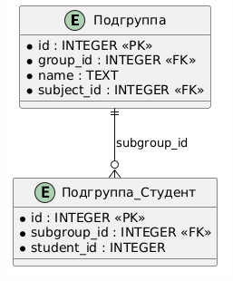

# Вариант №8. Сервис подгрупп (Subgroup Service) 

## 1. Создать подгруппу
**POST** `/subgroups`

**Информация для создания:**

| Параметр | Обязательность | Тип | Ограничение |
|----------|---------------|-----|-------------|
| name | Обязательно | Строка | - |
| group_id | Обязательно | Целое | Внешний ключ к группе |
| subject_id | Обязательно | Целое | Внешний ключ к предмету |

**Уникальная комбинация:** `(group_id, name)`

**Выходные данные:**

| Параметр | Тип |
|----------|-----|
| id | Целое |
| name | Строка |
| group_id | Целое |
| subject_id | Целое |

---

## 2. Изменить подгруппу по ID
**PATCH** `/subgroups/{id}`

**Информация для изменения:**

| Параметр | Обязательность | Тип | Ограничение |
|----------|---------------|-----|-------------|
| name | Опционально | Строка | - |
| subject_id | Опционально | Целое | Внешний ключ к предмету |

**Выходные данные:**

| Параметр | Тип |
|----------|-----|
| id | Целое |
| name | Строка |
| group_id | Целое |
| subject_id | Целое |

---

## 3. Удалить подгруппу по ID
**DELETE** `/subgroups/{id}`

**Возвращает:** `True`, если подгруппа была удалена, иначе `False`

---

## 4. Получить подгруппу по ID
**GET** `/subgroups/{id}`

**Выходные данные:**

| Параметр | Тип |
|----------|-----|
| id | Целое |
| name | Строка |
| group_id | Целое |
| subject_id | Целое |

---

## 5. Получить список подгрупп по заданным параметрам
**GET** `/subgroups`

**Входные параметры (query params):**

| Параметр | Тип | Обязательность | Описание |
|----------|-----|---------------|----------|
| group_id | Целое | Обязательно | Фильтр по группе |
| name | Строка | Опционально | Фильтр по имени |
| subject_id | Целое | Опционально | Фильтр по предмету |

**Выходные данные (массив объектов):**

| Параметр | Тип |
|----------|-----|
| id | Целое |
| name | Строка |
| group_id | Целое |
| subject_id | Целое |

---

## 6. Добавить студента в подгруппу
**POST** `/subgroup-students`

**Информация для создания:**

| Параметр | Обязательность | Тип | Ограничение |
|----------|---------------|-----|-------------|
| subgroup_id | Обязательно | Целое | Внешний ключ к подгруппе |
| student_id | Обязательно | Целое | Внешний ключ к студенту |

**Выходные данные:**

| Параметр | Тип |
|----------|-----|
| id | Целое |
| subgroup_id | Целое |
| student_id | Целое |

---

## 7. Удалить студента из подгруппы
**DELETE** `/subgroup-students/{id}`

**Возвращает:** `True`, если запись была удалена, иначе `False`

---

## 8. Получить всех студентов подгруппы
**GET** `/subgroups/{id}/students`

**Выходные данные (массив объектов):**

| Параметр | Тип |
|----------|-----|
| id | Целое |
| subgroup_id | Целое |
| student_id | Целое |

---

### ER-диаграмма
